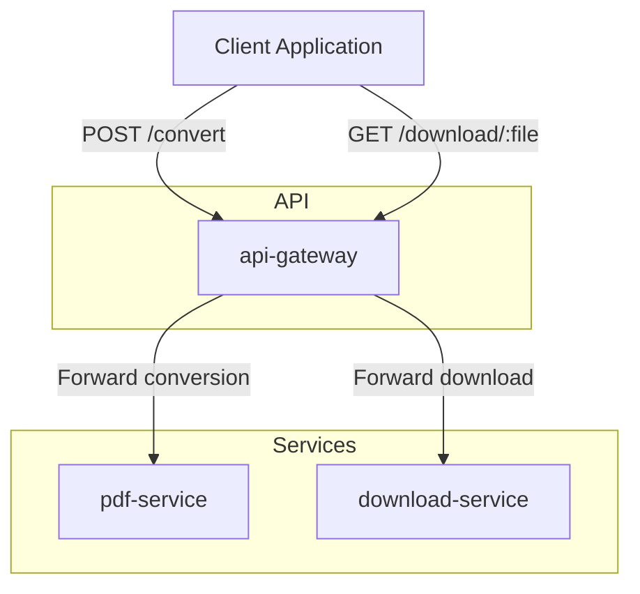

# API Media

A microservices based media processing platform built with goLang to test the observabilty and flows.

The project is composed of 3 services:

- api-gateway -> Entry point for clients;
- pdf-convert-service -> Converts PDF into files;
- download-service -> Serves generated files for download;

## Requirements 
 - goLang 1.25+
 - Docker
 - Docker Compose

## Architecture  



## Project Structure 

```
api-media/
├── api-gateway/
├── pdf-service/
├── download-service/
├── docker-compose.yml
└── README.md
```

## Running Locally 

```
$ docker compose build --no-cache
$ docker compose up
```

To test the flow:
```
curl --location 'localhost:8080/pdf/pdf-to-image' \
    --form 'file=@"/path/to/pdf/file.pdf"' \
    --form 'ttl_minutes="10"
```